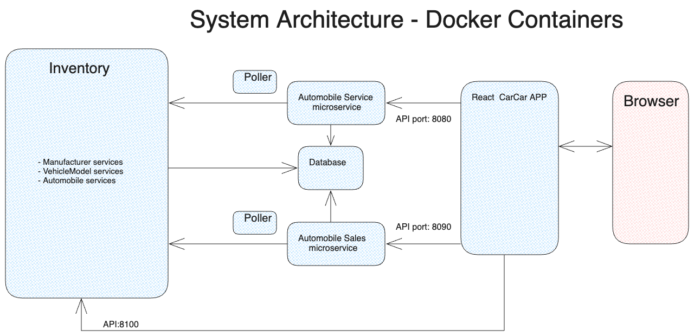

# CarCar - Car Dealership Management App
CarCar is a web application for managing sales and services at car dealerships.

## Team
- Howard - Car sale microservice.
- Marcio - Car service microservice.

## Installation
This system is containerized and requires Docker to be installed on your host system before proceeding with the installation. Here are the steps to follow:
- Download the source code from https://gitlab.com/galvanize9283031/project-beta/-/archive/main/project-beta-main.zip.
- Decompress the image and navigate to the uncompressed directory.
- Create the beta-data volume by running `docker volume create beta-data`.
- Build the Docker images by running `docker-compose build`.
- Start the system by running `docker-compose up`. Please allow several minutes for the system to start, especially the first time you run it as it needs to initialize the database.
- Finally, open your browser and navigate to http://localhost:3000/ to access the application.

## Design
The architecture of this system is composed of seven subsystems, which are directly reflected in the containers generated by the Docker image. Below are the descriptions of each subsystem:
- `Inventory:` This subsystem provides the data model for the auto manufacturers, vehicle models, and automobiles in stock. It stores the information in the database and provides an API to access the data.
- `Auto Service Microservice:` This subsystem provides the data model for the maintenance services performed on the vehicles. It stores the information in the database and provides an API to access the data. Additionally, this microservice has a poller that periodically updates the internal data from the inventory.
- `Auto Sales Microservice:` This subsystem provides the data model for the sales of vehicles. It stores the information in the database and provides an API to access the data. Moreover, this microservice also has a poller that periodically updates the internal data from the inventory.
- `The Database:` This subsystem is a container that runs the PostgreSQL to provide database services to the other subsystems.
- `The React App:` This is the front-end app that is delivered to the browser when you access the host on port 3000. It serves as the user interface and interacts with the remaining subsystems to provide a seamless user experience.

<br>


## Accessing the Microservices

### Inventory Mircoservice

#### The manufacturer information is accessible through the following endpoints:

| Action                          | Method | URL                                          |
| --------------------------------| ------ | -------------------------------------------- |
| List manufacturers              | GET    | http://localhost:8100/api/manufacturers/     |
| Create a manufacturer           | POST   | http://localhost:8100/api/manufacturers/     |
| Get a specific manufacturer     | GET    | http://localhost:8100/api/manufacturers/:id/ |
| Update a specific manufacturer  | PUT    | http://localhost:8100/api/manufacturers/:id/ |
| Delete a specific manufacturer  | DELETE | http://localhost:8100/api/manufacturers/:id/ |

Example of creating a manufacturer:
```json
{
    "name": "Ford"
}
```

#### The model information is accessible through the following endpoints:

| Action                          | Method | URL                                         |
| --------------------------------| ------ | ------------------------------------------- |
| List vehicle models             | GET    | http://localhost:8100/api/models/           |
| Create a vehicle model          | POST   | http://localhost:8100/api/models/           |
| Get a specific vehicle model    | GET    | http://localhost:8100/api/models/:id/       |
| Update a specific vehicle model | PUT    | http://localhost:8100/api/models/:id/       |
| Delete a specific vehicle model | DELETE | http://localhost:8100/api/models/:id/       |

Example of creating a vehicle model:
```json
{
    "name": "Focus",
    "picture_url": "https://upload.wikimedia.org/front_20090302.jpg",
    "manufacturer_id": 1
}
```

#### The Automobile information is accessible through the following endpoints:

| Action                          | Method | URL                                         |
| --------------------------------| ------ | ------------------------------------------- |
| List automobiles                | GET    | http://localhost:8100/api/automobiles/      |
| Create an automobile            | POST   | http://localhost:8100/api/automobiles/      |
| Get a specific automobile       | GET    | http://localhost:8100/api/automobiles/:vin/ |
| Update a specific automobile    | PUT    | http://localhost:8100/api/automobiles/:vin/ |
| Delete a specific automobile    | DELETE | http://localhost:8100/api/automobiles/:vin/ |

Exmplae of creating an automobile:
```json
{
    "vin": "1FMCU9J90FUA00001",
    "model_id": 1,
    "color": "red",
    "year": 2015
}
```

Example of updating an automobile:
```json
{
    "color": "blue",
    "year": 2012,
    "sold": true
}
```

### Auto Sales Microservice
The microservice is accessible through the following endpoints:

| Action                          | Method | URL                                         |
| --------------------------------| ------ | ------------------------------------------- |
| List salespeople                | GET    | http://localhost:8090/api/salespeople/      |
| Create a salesperson            | POST   | http://localhost:8090/api/salespeople/      |
| Delete a specific salesperson   | DELETE | http://localhost:8090/api/salespeople/:id/  |
| List customers                  | GET    | http://localhost:8090/api/customers/        |
| Create a customer               | POST   | http://localhost:8090/api/customers/        |
| Delete a specific customer      | DELETE | http://localhost:8090/api/customers/:id/    |
| List sales                      | GET    | http://localhost:8090/api/sales/            |
| Create a sale                   | POST   | http://localhost:8090/api/sales/            |
| Delete a sale                   | DELETE | http://localhost:8090/api/sales/:id         |

### Auto Service Microservice
The microservice is accessible through the following endpoints:

| Action                               | Method | URL                                                |
| ------------------------------------ | ------ | -------------------------------------------------- |
| List technicians                     | GET    | http://localhost:8080/api/technicians/             |
| Create a technician                  | POST   | http://localhost:8080/api/technicians/             |
| Delete a specific technician         | DELETE | http://localhost:8080/api/technicians/:id/         |
| List appointments                    | GET    | http://localhost:8080/api/appointments/            |
| Create an appointment                | POST   | http://localhost:8080/api/appointments/            |
| Delete an appointment                | DELETE | http://localhost:8080/api/appointments/:id/        |
| Set appointment status to "canceled" | PUT    | http://localhost:8080/api/appointments/:id/cancel/ |
| Set appointment status to "finished" | PUT    | http://localhost:8080/api/appointments/:id/finish/ |

Exaple of adding a technician:
```json
{
    "first_name": "John",
    "last_name": "Doe",
    "employee_id": "1234"
}
```

Example of creating an appointment:
```json
{
    "vin": "1FMCU9J90FUA00001",
    "date_time": "2021-03-01T12:00:00.000Z",
    "reason": "Oil change",
    "vin": "ZZZ123...",
    "customer": "Charles Darwin",
    "technician": {Technician},
}
```
